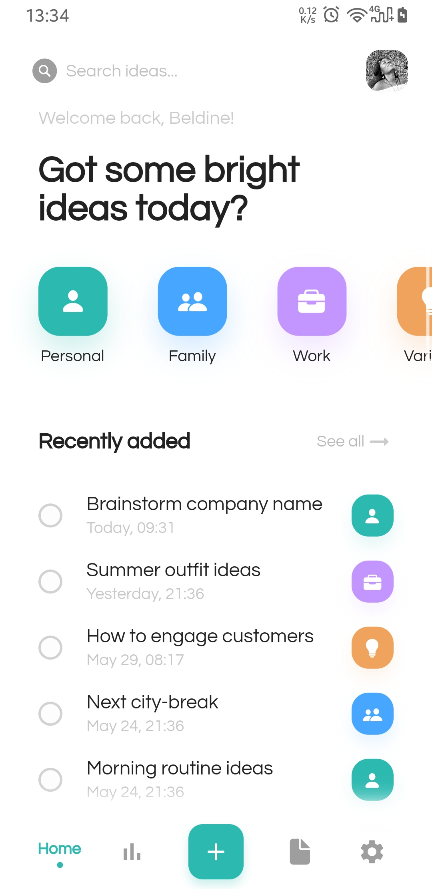

# Flutter/Dart Practice 01 (27/01/2021)

Flutter design preactice number 01

| Mine | Design to Replicate |
|-|-|
|  |  |

### Credits

> Project Name: [iDeaz-App](https://dribbble.com/shots/11978026-iDeaz-App)
>
> Author: [Victor Niculici](https://dribbble.com/victorniculici)

For help getting started with Flutter, view the
[online documentation](https://flutter.dev/docs), which offers tutorials,
samples, guidance on mobile development, and a full API reference.
