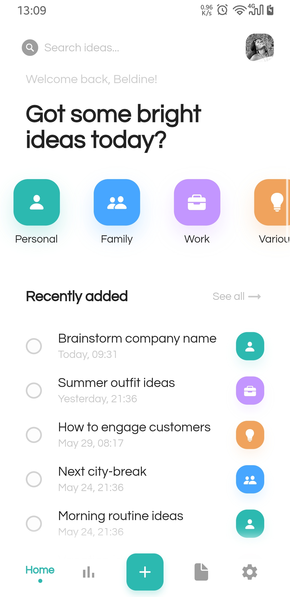

# Flutter/Dart Practice 01 (27/01/2021)

Flutter design preactice number 01

## Screenshots

## Design to replicate

> Project Name: [iDeaz-App](https://dribbble.com/shots/11978026-iDeaz-App)
>
> Author: [Victor Niculici](https://dribbble.com/victorniculici)

## Getting Started

This project is a starting point for a Flutter application.

A few resources to get you started if this is your first Flutter project:

- [Lab: Write your first Flutter app](https://flutter.dev/docs/get-started/codelab)
- [Cookbook: Useful Flutter samples](https://flutter.dev/docs/cookbook)

For help getting started with Flutter, view our
[online documentation](https://flutter.dev/docs), which offers tutorials,
samples, guidance on mobile development, and a full API reference.
